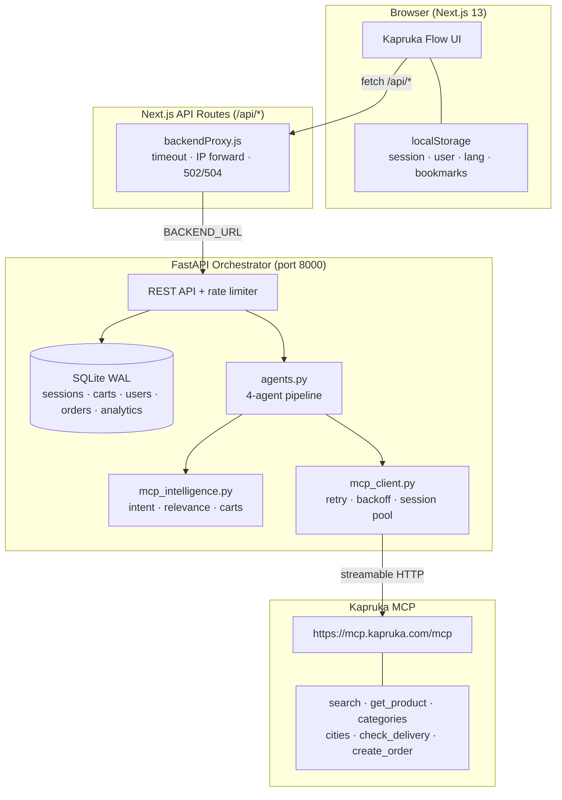
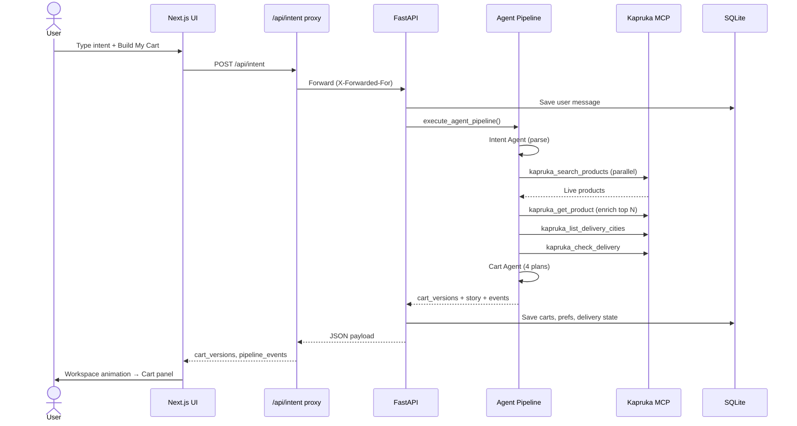
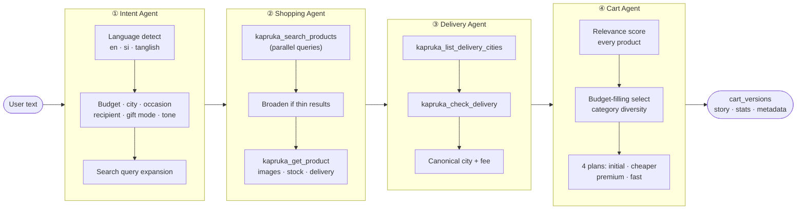
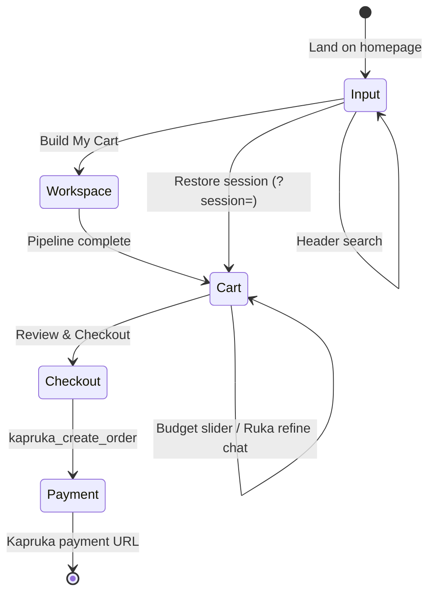
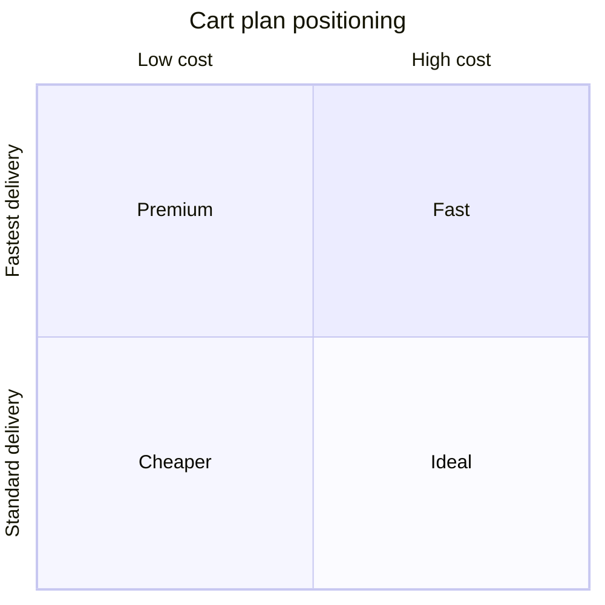

# Kapruka Flow AI

[](https://www.kapruka.com/contactUs/agentChallenge.html)
[](https://mcp.kapruka.com/)
[](https://fastapi.tiangolo.com/)
[](https://nextjs.org/)

**Tell us what you want. We'll build the shopping plan.**

AI-first shopping for the [Kapruka Agent Challenge 2026](https://www.kapruka.com/contactUs/agentChallenge.html). Describe your intent in **English, Sinhala, or Tanglish** - Kapruka Flow turns it into four budget-aware cart plans and completes a real guest checkout via the free public [Kapruka MCP](https://mcp.kapruka.com/) (no API key required).

**Live demo:** [kapruka-flow-ai.vercel.app](https://kapruka-flow-ai.vercel.app)  
**Repository:** [github.com/Thanuka9/kapruka-flow-AI](https://github.com/Thanuka9/kapruka-flow-AI)

---

## Table of contents

- [What makes this different](#what-makes-this-different)
- [System architecture](#system-architecture)
- [Agent pipeline](#agent-pipeline)
- [User journey](#user-journey)
- [Frontend features](#frontend-features)
- [Cart plans](#cart-plans)
- [MCP tools](#mcp-tools-used)
- [Tech stack](#tech-stack)
- [Project structure](#project-structure)
- [Quick start](#quick-start)
- [Environment variables](#environment-variables)
- [API reference](#api-reference)
- [Judge walkthrough](#judge-walkthrough)
- [Testing](#testing)
- [Deployment](#deployment)
- [Production notes](#production-notes)
- [Related docs](#related-docs)

---

## What makes this different

| Traditional e-commerce | Kapruka Flow |
|------------------------|--------------|
| Search → product → cart | **Intent → plan → compare → checkout** |
| Keyword matching | **Multilingual intent parsing** (en / si / tanglish) |
| Single cart | **4 optimized plans** - Ideal, Cheaper, Premium, Fast |
| Static catalog browse | **Live Kapruka MCP** search, enrich, validate, order |
| Anonymous only | **Accounts + order history** personalize future plans |
| Hidden AI | **Transparent MCP activity feed** - every tool call visible |

### Highlights

- **Intent, not search** - natural language in English, Sinhala, or Tanglish
- **MCP-native intelligence** - deterministic planner (no external LLM key); relevance scoring + budget filling
- **Live Kapruka MCP** - real catalog search, delivery validation, guest checkout
- **User accounts + order history** - AI personalizes plans from past orders and saved bookmarks
- **All Categories nav** - browse Kapruka categories like the main site
- **4 cart plans** - Ideal, Cheaper, Premium, Fast with animated diffs and comparison matrix
- **Instant budget adjust** - drag slider; plans re-optimize client-side in milliseconds
- **Conversational refine** - chat with Ruka to add/remove items, change budget, or delivery city
- **Kapruka.com UI** - red/white header, search bar, category menu, three localized UI languages

---

## System architecture



### Request flow (intent → cart)



---

## Agent pipeline

Four specialized agents run sequentially inside a **single shared MCP session** for efficiency. Events are streamed to the UI as `pipeline_events` so judges can see every MCP tool invoked.



### Intelligence engine (`mcp_intelligence.py`)

| Module | Responsibility |
|--------|----------------|
| **Intent parsing** | Multilingual lexicons, budget extraction (lakh/k/RS), city aliases, occasion & recipient detection, empathetic/celebratory tone |
| **Relevance engine** | Scores each MCP product against user keywords, categories, gift context, profile & bookmarks |
| **Cart selector** | Hard budget cap, category diversity caps, staple quantity fill, mode-specific ranking |
| **User profile** | Learns preferred city, budget, and categories from order history + saved products |
| **Story builder** | Localized narrative explaining what was found, selected, and delivered |

### Backend resilience (reviewed in `main.py`, `agents.py`, `mcp_client.py`)

- MCP tool calls: bounded timeout, retry with backoff, shared session per pipeline run
- Rate limits (per client IP): `/api/intent` 10/min, `/api/checkout` 6/min, `/api/login` 12/min, `/api/search` 30/min
- In-memory caches: search (60s), categories (30m), health probe (20s), city autocomplete
- Checkout: idempotency per `session_id + cart_version`, concurrency lock, live price verify (±5%), stock check
- Graceful degradation: pipeline survives MCP session teardown; optional fallback catalog behind `ALLOW_FALLBACK_CATALOG`

---

## User journey



1. **Input** - Intent canvas, category browse, header search, seasonal nudges, "Picked for you"
2. **Workspace** - Ruka agent persona, MCP activity ticker, curation story animation
3. **Cart** - Four plan tabs, plan diff banner, comparison matrix, evolution timeline, curation score
4. **Checkout** - Delivery form, city autocomplete, live delivery map, price/stock verify, real MCP order
5. **Payment** - Redirect to Kapruka `paymentGatewayCheck.jsp`

---

## Frontend features

All client-side intelligence is **rule-based** (no external LLM) - same philosophy as the backend.

| Feature | File(s) | What it does |
|---------|---------|--------------|
| **Ruka chat + refine** | `RukaChat.js`, `refine.js` | Follow-up messages: add/remove items, change budget, switch plan, update city |
| **MCP activity ticker** | `McpActivityTicker.js` | Live feed of pipeline steps and MCP tools used |
| **Instant rebudget** | `rebudget.js` | Slider re-ranks carts from cached catalog without a new API call |
| **Plan diff** | `PlanDiff.js` | Animated banner when switching Ideal / Cheaper / Premium / Fast |
| **Compare matrix** | `PlanComparisonMatrix.js` | Side-by-side plan comparison modal |
| **Cart evolution** | `index.js`, `/api/cart` | Timeline of cart snapshots as user refines |
| **Curation report** | `CurationReport.js` | Budget efficiency, variety, and recipient-match score |
| **Bookmarks** | `bookmarks.js`, `userContext.js` | Star products in localStorage; sent to backend to boost relevance |
| **Personalization** | `personalize.js` | Sri Lanka seasonal prompts (Avurudu, Christmas, Valentine's), order-history suggestions |
| **Reorder** | `userContext.js` | One-click reorder prompt from past orders in profile |
| **Share Flow** | `ShareFlowButton.js` | Copy `?session=<uuid>` link to restore a cart |
| **Live delivery map** | `LiveDeliveryMap.js` | Animated route from Colombo to delivery city in checkout |
| **Localization** | `localization.js` | Full UI strings for `en-US`, `si-LK`, `en-LK` (Tanglish) |
| **Auth** | `AuthModals.js` | Register/login; profile with order history |
| **Error handling** | `ErrorBoundary.js`, `FlowError.js` | Graceful UI errors with retry |
| **Demo prompt** | `constants/demo.js` | Frozen judge prompt: *"Amma birthday gift under 10000 deliver to Kandy tomorrow"* |

### Key components

`IntentCanvas` · `AIWorkspace` · `CartPanel` · `CheckoutModal` · `KaprukaHeader` · `ProductCard` · `AnimatedTotal` · `AgentPersona` · `Icon3D`

---

## Cart plans

All four plans respect the user's **hard budget cap** (items + delivery ≤ budget). They differ in *how* the budget is spent, not whether it is exceeded.



| Plan | Budget use | Selection strategy | Delivery bias |
|------|------------|-------------------|---------------|
| **Ideal** | Up to 100% of cap | Best relevance × value | Balanced |
| **Cheaper** | ~70% of cap | Max relevance per rupee | Balanced |
| **Premium** | Up to 100% of cap | Higher-quality / pricier picks | Balanced |
| **Fast** | Up to 100% of cap | Relevance first | Today / Fast products only |

---

## MCP tools used

| Tool | Used by | Purpose |
|------|---------|---------|
| `kapruka_search_products` | Shopping Agent, `/api/search` | Live catalog search |
| `kapruka_get_product` | Shopping Agent, Checkout | Images, stock, price verify |
| `kapruka_list_categories` | `/api/categories`, health | Category nav + readiness probe |
| `kapruka_list_delivery_cities` | Delivery Agent, `/api/cities` | City autocomplete |
| `kapruka_check_delivery` | Delivery Agent, Checkout | Fee + availability |
| `kapruka_create_order` | Checkout | Real guest order + payment URL |

---

## Tech stack

| Layer | Technology |
|-------|------------|
| Frontend | Next.js 13, React 18, Tailwind CSS, Framer Motion |
| API proxy | Next.js API routes (`backendProxy.js`), standalone output |
| Backend | FastAPI, Pydantic v2, uvicorn |
| MCP client | `mcp` SDK, streamable HTTP transport |
| Database | SQLite (WAL mode, PBKDF2-SHA256 auth) |
| CI | GitHub Actions - Ruff lint/format, Next.js build |
| E2E | Playwright smoke tests (`frontend/tests/smoke.spec.ts`, run locally) |

---

## Project structure

```
kapruka-flow-AI/
├── backend/
│   ├── app/
│   │   ├── main.py              # FastAPI routes, rate limit, caches
│   │   ├── agents.py            # 4-agent pipeline orchestration
│   │   ├── mcp_intelligence.py  # Intent parsing, relevance, cart building
│   │   ├── mcp_client.py        # MCP session + retry logic
│   │   ├── database.py          # SQLite persistence
│   │   ├── config.py            # 12-factor settings
│   │   └── logging_config.py    # Structured logging
│   ├── requirements.txt
│   ├── Dockerfile
│   └── README.md
├── frontend/
│   ├── pages/
│   │   ├── index.js             # Main app shell + state machine
│   │   └── api/                 # 11 proxy routes → backend
│   ├── components/              # 20 UI components (see Frontend features)
│   ├── utils/                   # rebudget, refine, bookmarks, personalize, userContext
│   ├── constants/demo.js        # Frozen judge demo prompt
│   ├── tests/smoke.spec.ts      # Playwright E2E (7 scenarios)
│   ├── next.config.js           # Security headers, Kapruka image domains
│   └── Dockerfile
├── .github/workflows/ci.yml
├── .env.example
├── projectplan.md               # Full product spec
├── test.md                      # Manual judge test matrix
└── README.md
```

---

## Quick start

### Prerequisites

- Python 3.10+
- Node.js 18+
- Network access to `https://mcp.kapruka.com/mcp`

### Backend

```powershell
cd backend
python -m venv .venv
.\.venv\Scripts\activate          # macOS/Linux: source .venv/bin/activate
pip install -r requirements.txt
uvicorn app.main:app --reload --port 8000
```

### Frontend

```powershell
cd frontend
npm install
$env:BACKEND_URL="http://localhost:8000"   # macOS/Linux: export BACKEND_URL=...
npm run dev
```

Open **http://localhost:3000**

**Health check:** `GET http://localhost:3000/api/health` → `"mcp": { "ok": true }`

**Demo mode:** `http://localhost:3000/?demo=1` - auto-runs the frozen judge prompt

---

## Environment variables

Copy `.env.example` for backend; set `BACKEND_URL` on your frontend host.

| Variable | Scope | Code default | Recommended (judging) | Description |
|----------|-------|--------------|----------------------|-------------|
| `MCP_URL` | backend | `https://mcp.kapruka.com/mcp` | same | Kapruka MCP endpoint |
| `MCP_TIMEOUT` | backend | `30` | `30` | Seconds per MCP tool call |
| `MCP_MAX_RETRIES` | backend | `2` | `2` | Extra attempts on MCP failure |
| `MCP_RETRY_BACKOFF` | backend | `0.75` | `0.75` | Backoff base (seconds × attempt) |
| `ALLOWED_ORIGINS` | backend | `localhost:3000` | your frontend URL | Comma-separated CORS origins |
| `ENVIRONMENT` | backend | `development` | `production` | Hides `/docs` when `production` |
| `LOG_LEVEL` | backend | `INFO` | `INFO` | Structured log verbosity |
| `DB_PATH` | backend | `./flow.db` | mounted volume | SQLite file path |
| `ALLOW_SIMULATED_CHECKOUT` | backend | `false` | **`false`** | Never enable for live judging |
| `ALLOW_FALLBACK_CATALOG` | backend | `false` | **`false`** | Keep false for live MCP-only demos |
| `BACKEND_URL` | frontend | `http://localhost:8000` | your API URL | FastAPI URL for Next.js proxy |
| `PROXY_TIMEOUT_MS` | frontend | `120000` | `120000` | Frontend→backend proxy timeout |

---

## API reference

| Method | Path | Description |
|--------|------|-------------|
| `POST` | `/api/intent` | Build shopping plan from natural language |
| `GET` | `/api/session?session_id=` | Restore session (shareable `?session=` links) |
| `POST` | `/api/cart` | Persist cart edits + evolution timeline |
| `POST` | `/api/checkout` | Verify stock/price, create Kapruka order |
| `GET` | `/api/search?q=` | Header search (cached 60s) |
| `GET` | `/api/categories` | Category nav (cached 30m) |
| `GET` | `/api/cities?q=` | Delivery city autocomplete |
| `POST` | `/api/login` | Register / login (PBKDF2) |
| `GET` | `/api/profile/orders?email=` | Order history for personalization |
| `POST` | `/api/analytics` | Client event logging |
| `GET` | `/api/health` | MCP readiness (throttled 20s) |
| `GET` | `/healthz` | Liveness probe |
| `GET` | `/api/version` | App name + version |

Full interactive docs (dev only): `http://localhost:8000/docs`

---

## Judge walkthrough

| Step | Action | What to verify |
|------|--------|----------------|
| 1 | Open [live demo](https://kapruka-flow-ai.vercel.app) | **MCP Live** badge in header |
| 2 | Sign in or register | Profile modal shows email + order history |
| 3 | Use **All Categories** or header search | Category-driven intent with `category_hint` |
| 4 | Enter: *"Amma birthday gift under 10000 deliver to Kandy tomorrow"* | Sinhala/Tanglish also work |
| 5 | Watch workspace | MCP activity ticker shows `kapruka_search_products`, etc. |
| 6 | Switch cart tabs | Plan diff banner; Compare Versions matrix; curation score |
| 7 | Chat with Ruka: *"add chocolates"* or *"deliver to Galle"* | Refine updates cart without full rebuild where possible |
| 8 | Drag budget slider | Instant rebudget without new API call |
| 9 | Star a product, rebuild intent | Bookmark boost in relevance ranking |
| 10 | Checkout → fill delivery → Continue to Payment | Live map, real `kapruka_create_order` → Kapruka payment URL |
| 11 | Click **Share Flow** | `?session=` link restores the cart |

---

## Testing

### CI (GitHub Actions)

On every push/PR to `main`:

- **Backend:** `ruff check` + `ruff format --check`
- **Frontend:** `npm run build`

### Local E2E (Playwright)

```powershell
# Terminal 1-2: start backend + frontend (see Quick start)
cd frontend
npx playwright test tests/smoke.spec.ts
```

Covers: guest cart build, login/profile, language switch, suggestions, checkout validation, compare modal, category menu.

### Manual test matrix

See [`test.md`](test.md) for the full judge checklist (multilingual prompts, budget edge cases, MCP tool visibility, production smoke).

---

## Deployment

### Docker (recommended)

```bash
# Backend
docker build -t kapruka-flow-api ./backend
docker run -p 8000:8000 \
  -e ALLOWED_ORIGINS="https://kapruka-flow-ai.vercel.app" \
  -e ALLOW_FALLBACK_CATALOG=false \
  -v kapruka-data:/app/flow.db \
  kapruka-flow-api

# Frontend (Next.js standalone)
docker build -t kapruka-flow-web ./frontend
docker run -p 3000:3000 \
  -e BACKEND_URL="https://your-api.example.com" \
  kapruka-flow-web
```

### Managed hosting

| Service | Role | Notes |
|---------|------|-------|
| **Vercel** | Frontend | Set `BACKEND_URL` env var |
| **Railway / Render / Fly.io** | Backend | Expose port 8000; mount `DB_PATH` volume |

Both services must be running for the full experience.

---

## Production notes

- **Security** - Passwords stored as salted PBKDF2-SHA256; CORS locked to `ALLOWED_ORIGINS`; security headers (`X-Frame-Options`, `nosniff`, `Referrer-Policy`, `Permissions-Policy`) in `next.config.js`
- **Resilience** - MCP calls use bounded timeouts + retry-with-backoff; checkout verifies live price (±5%) and stock; idempotent orders per `session_id + cart_version`
- **Rate limiting** - In-process limits on `/api/intent`, `/api/checkout`, `/api/login`, `/api/search` (per client IP via `X-Forwarded-For`)
- **Observability** - Structured request logging; `GET /healthz` (liveness), `GET /api/health` (MCP readiness), `GET /api/version`
- **Data** - SQLite WAL mode with indexes on hot paths; mount `DB_PATH` to a persistent volume in production
- **Judging** - Keep `ALLOW_SIMULATED_CHECKOUT=false` and `ALLOW_FALLBACK_CATALOG=false` so every product and order comes from live MCP

---

## Related docs

| File | Contents |
|------|----------|
| [`backend/README.md`](backend/README.md) | Backend quick reference |
| [`projectplan.md`](projectplan.md) | Full product vision and spec |
| [`JUDGE_BRIEF.md`](JUDGE_BRIEF.md) | Concise overview for challenge judges |
| [`test.md`](test.md) | Manual judge test matrix |
| [`.env.example`](.env.example) | All environment variables |

---

## Author

**Thanuka Ellepola** - Kapruka Agent Challenge 2026 entry  
Built with the public [Kapruka MCP](https://mcp.kapruka.com/) - no proprietary API key required.
